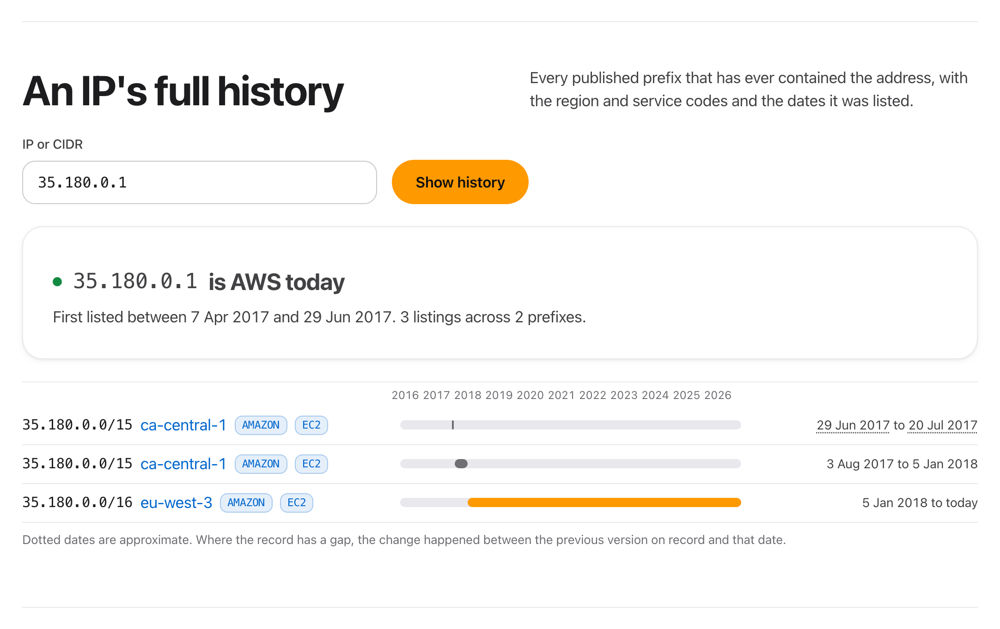
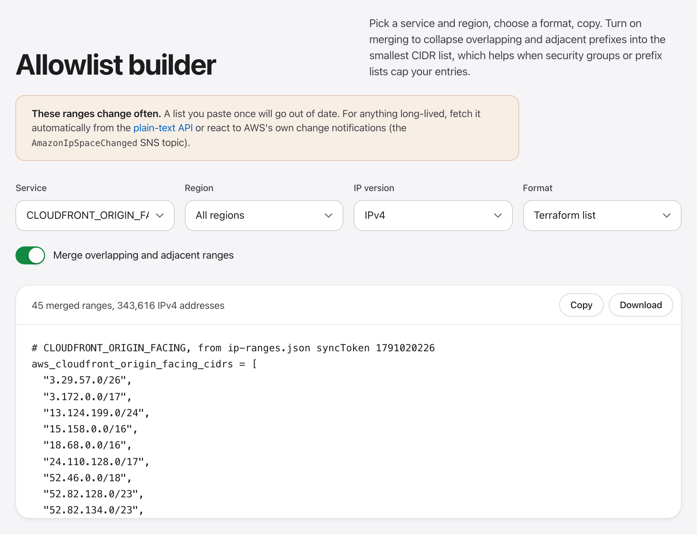
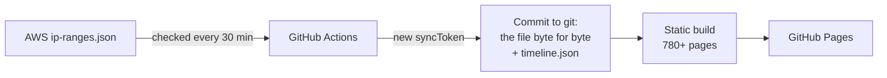

<div align="center">

<a href="https://manishh-13.github.io/aws-ip-map/"></a>

<h1>AWS IP Map</h1>

<p><b>Every public IP range AWS publishes. Look up any IP, see it on a map of the whole internet,<br>and go back in time to 2015.</b></p>

<p>
<a href="https://manishh-13.github.io/aws-ip-map/"><b>Website</b></a> &nbsp;·&nbsp;
<a href="https://manishh-13.github.io/aws-ip-map/history/">History</a> &nbsp;·&nbsp;
<a href="https://manishh-13.github.io/aws-ip-map/changes/">Change log</a> &nbsp;·&nbsp;
<a href="https://manishh-13.github.io/aws-ip-map/#allowlist">Allowlist builder</a> &nbsp;·&nbsp;
<a href="https://manishh-13.github.io/aws-ip-map/api/">API</a> &nbsp;·&nbsp;
<a href="https://manishh-13.github.io/aws-ip-map/changes.xml">Atom feed</a>
</p>

<p>
<a href="https://github.com/manishh-13/aws-ip-map/actions/workflows/update.yml"></a>
<a href="https://manishh-13.github.io/aws-ip-map/"></a>
<a href="https://manishh-13.github.io/aws-ip-map/changes/"></a>
<a href="https://manishh-13.github.io/aws-ip-map/history/"></a>

<a href="LICENSE"></a>
</p>

<a href="https://manishh-13.github.io/aws-ip-map/">
<picture>
  <source media="(prefers-color-scheme: dark)" srcset="docs/screenshot-dark.png">
  
</picture>
</a>

</div>

## Paste an IP. Get the answer.

AWS publishes every public IP range it uses as one 2.7 MB JSON file, [`ip-ranges.json`](https://ip-ranges.amazonaws.com/ip-ranges.json). It's the source of truth, and it's not built for people to read. AWS IP Map turns it into a site you can search in a second: paste an address and see whether it's AWS, which region and service it belongs to, and how long it has been there.

| Look up | Go back in time | Build with it |
| --- | --- | --- |
| Any IPv4 or IPv6 address, a CIDR, or a whole log paste | Any IP's full history since 2015 | Allowlists in 8 formats, from plain text to Terraform |
| Region, service and network border group, instantly | `ip-ranges.json` as it was on any date, ready to download | A plain-text API for every region and service |
| See it on a map of all 4.3 billion IPv4 addresses | Compare any two dates, entry by entry | An Atom feed for every new change |

<table>
<tr>
<td width="50%" valign="top"><a href="https://manishh-13.github.io/aws-ip-map/history/?ip=35.180.0.1#ip"></a><br><b>An IP's whole story.</b> When it joined AWS, every region and service move, and when it left.</td>
<td width="50%" valign="top"><a href="https://manishh-13.github.io/aws-ip-map/#allowlist"></a><br><b>Allowlists you can paste.</b> Pick a service, region and IP version. Get nginx, iptables, Terraform, a managed prefix list command and more, optionally merged into the fewest CIDRs.</td>
</tr>
</table>

## Who it's for

- **Security and network teams:** check whether an address in a log, alert or firewall rule really is AWS, and which service it belongs to.
- **Anyone writing allowlists:** CloudFront origin-facing ranges, API Gateway egress, S3 in one region, Route 53 health checks. Each one is a stable URL you can `curl`.
- **The curious:** watch AWS grow region by region on the map, and spot region codes in the file before AWS has announced them.

## Use it from the command line

```sh
# every CloudFront origin-facing IPv4 range, one per line
curl -s https://manishh-13.github.io/aws-ip-map/services/cloudfront-origin-facing/ipv4.txt

# S3 in Mumbai
curl -s https://manishh-13.github.io/aws-ip-map/regions/ap-south-1/s3/ipv4.txt

# everything, as CSV
curl -s https://manishh-13.github.io/aws-ip-map/ranges.csv
```

Every region, service, and region plus service pair has `ipv4.txt`, `ipv6.txt`, `ranges.csv` and `ranges.json`. The [API page](https://manishh-13.github.io/aws-ip-map/api/) lists them all.

## How it stays current



- **No server, no database, no AWS account.** A scheduled GitHub Action checks the file every 30 minutes. When AWS publishes a new version, the Action commits it and redeploys the site.
- **The repo is the archive.** `data/ip-ranges.json` is the latest file byte for byte, so its git history keeps every version from launch on. `data/timeline.json` holds the whole history since 2015 as entry lifetimes, one entry per line, so each update is a small, readable diff.
- **Fast everywhere.** Every region and service gets its own static page. The map is pre-rendered at build time (one pixel per /20) with a canvas on top for hover and zoom. Zero npm dependencies, just the Node standard library.

<details>
<summary><b>Where the history comes from</b></summary>
<br>

AWS doesn't publish old versions of the file; [its docs](https://docs.aws.amazon.com/vpc/latest/userguide/aws-ip-ranges.html) suggest saving successive versions yourself. So the history from before this site existed is merged from two public trackers, matched on AWS's own `createDate` and `syncToken`, and checked entry for entry against the original files:

- [joetek/aws-ip-ranges-json](https://github.com/joetek/aws-ip-ranges-json) has tracked the file in git since July 2017.
- [seligman/aws-ip-ranges](https://github.com/seligman/aws-ip-ranges), an SNS-triggered tracker running since 2020, adds the versions joetek missed. Its archive also covers November 2015 to July 2017 with occasional captures, so changes in that period are shown as happening between two dates.
- One [Internet Archive](https://web.archive.org/) capture fills part of a gap in late 2019.

From launch on, this repo records every version itself. Thank you, joetek and seligman.

</details>

<details>
<summary><b>Run it locally or fork it</b></summary>
<br>

Requires Node 20 or newer. There is nothing to install.

```sh
npm run update      # fetch the live ip-ranges.json into data/
npm run dev         # build and serve at http://localhost:4173/aws-ip-map/
npm test
npm run history     # optional: rebuild the full history from joetek, seligman and the Internet Archive
```

To run your own copy, fork the repo, set **Settings > Pages > Source** to **GitHub Actions**, set `SITE_URL`, `BASE_PATH` and `REPO_URL` (see `scripts/site.mjs`) if your URL differs, and run the **Update and deploy** workflow once.

</details>

## Notes

- Unofficial project, not affiliated with or endorsed by Amazon Web Services. The source of truth is always AWS's own [ip-ranges.json](https://ip-ranges.amazonaws.com/ip-ranges.json) and its [documentation](https://docs.aws.amazon.com/vpc/latest/userguide/aws-ip-ranges.html).
- Ranges change several times a day. For production allowlists, automate: pull from the API here, or subscribe to AWS's SNS topic `arn:aws:sns:us-east-1:806199016981:AmazonIpSpaceChanged` ([docs](https://docs.aws.amazon.com/vpc/latest/userguide/subscribe-notifications.html)).

## License

[MIT](LICENSE)
