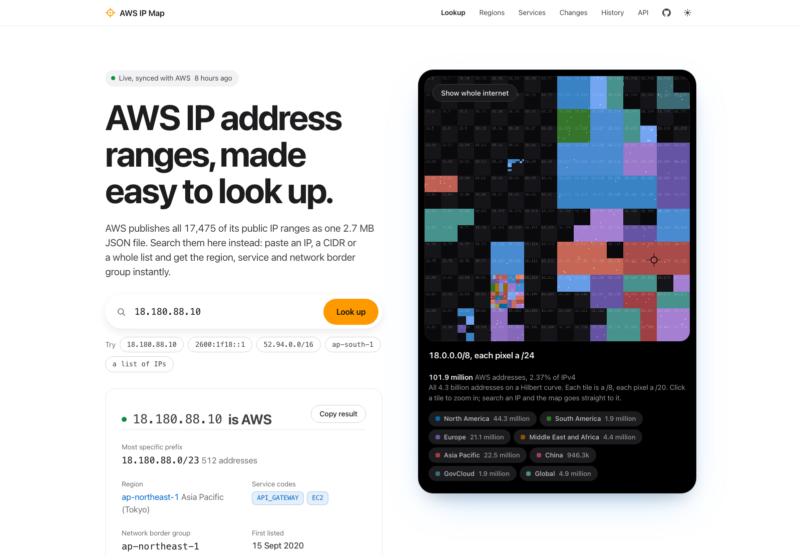
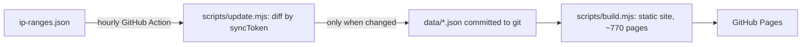

# AWS RangeFinder: AWS IP address ranges, made easy to look up

**Live site: https://manishh-13.github.io/aws-rangefinder/**

AWS publishes every public IP range it uses as one 2.7 MB JSON file, [`ip-ranges.json`](https://ip-ranges.amazonaws.com/ip-ranges.json). AWS RangeFinder turns it into a fast, searchable site. Paste an IP to see whether it belongs to AWS, which region and service it's in, and how long it has been there. Browse every region and service, build allowlists in the format you need, and see exactly what changed each time AWS republishes the file.



## What it does

- **Look up any IP.** Paste one IPv4 or IPv6 address, a CIDR, or a whole list (log lines are fine). You get the most specific matching prefix, region, service codes, network border group and the month it first appeared. If the address used to be AWS, it tells you when.
- **A 3D map of the whole IPv4 internet.** All 4.3 billion addresses laid out on a Hilbert curve, with AWS space coloured by region. Click any /8 to zoom in. Click any /8 to zoom in to /24 detail; search an IP and the map flies to it.
- **Every version since 2015, searchable.** The History page shows an IP's full timeline (when it joined AWS, region and service moves, when it left), rebuilds and downloads ip-ranges.json exactly as it was on any date, and compares any two dates. Region codes often show up long before a region launches, and the site flags codes AWS hasn't named yet.
- **Change log and Atom feed.** Every change since 2016, prefix by prefix, with a page per year.
- **Allowlist builder.** Pick a service, region and IP version, then get plain text, CSV, JSON, Terraform, nginx, Apache, iptables or an `aws ec2 create-managed-prefix-list` command. Optional merging collapses overlapping and adjacent ranges into the smallest CIDR list.
- **Plain-text API.** Stable URLs for every region, service and region-service pair:

```sh
curl -s https://manishh-13.github.io/aws-rangefinder/services/cloudfront-origin-facing/ipv4.txt
curl -s https://manishh-13.github.io/aws-rangefinder/regions/ap-south-1/s3/ipv4.txt
curl -s https://manishh-13.github.io/aws-rangefinder/ranges.csv
```

See [/api/](https://manishh-13.github.io/aws-rangefinder/api/) for the full list.

## How it works



- No server, no database, no AWS account. A scheduled GitHub Action checks the file every hour; when the `syncToken` changes, it commits the new data and redeploys.
- `data/ip-ranges.json` is the latest file byte for byte, and `data/timeline.json` holds the complete history as entry lifetimes (one entry per line, so each hourly commit is a small, readable diff).
- Every region and service gets its own static, indexable page with structured data (Dataset, FAQ, breadcrumbs), a sitemap and an Atom feed.
- The map is rendered once at build time as an indexed PNG (one pixel per /20), with a canvas overlay for hover, zoom and highlights. Zero dependencies: Node standard library only.

## Run it locally

Requires Node 20 or newer.

```sh
npm run update      # fetch the live ip-ranges.json into data/
npm run history     # optional: rebuild the full history (Internet Archive + joetek git history, a few minutes)
npm run dev         # build and serve at http://localhost:4173/aws-rangefinder/
npm test
```

## Fork it

1. Fork the repo, then in **Settings > Pages** set **Source** to **GitHub Actions**.
2. Set `SITE_URL`, `BASE_PATH` and `REPO_URL` (see `scripts/site.mjs`) if your URL differs.
3. Run the **Update and deploy** workflow once from the Actions tab.

## Notes

- Unofficial project, not affiliated with or endorsed by Amazon Web Services. The source of truth is always AWS's own [ip-ranges.json](https://ip-ranges.amazonaws.com/ip-ranges.json) and its [documentation](https://docs.aws.amazon.com/vpc/latest/userguide/aws-ip-ranges.html).
- For production allowlists that must react within minutes, subscribe to AWS's SNS topic `arn:aws:sns:us-east-1:806199016981:AmazonIpSpaceChanged` ([docs](https://docs.aws.amazon.com/vpc/latest/userguide/subscribe-notifications.html)).
- History: November 2015 to July 2017 comes from the last [Internet Archive](https://web.archive.org/) capture of each month, so changes in that period are accurate to the month. From July 2017 every version comes from [joetek/aws-ip-ranges-json](https://github.com/joetek/aws-ip-ranges-json), which has tracked the file in git since 2017. Thank you, joetek. The whole history is one file, `data/timeline.json`: every entry ever published, with the versions during which it was listed.

## License

MIT
